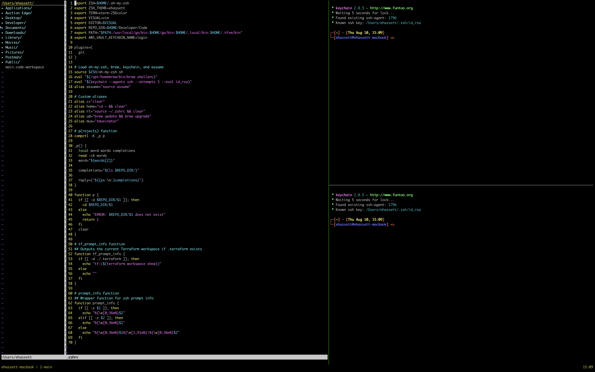

# Ethan's dotfiles

This repo contains a collection of my dotfiles. Suggestions and contributions are welcome!

# Screenshot

# Prerequisites

Xcode Command Line Tools are needed before cloning this repo. Install with `xcode-select --install`.

I currently use [iTerm2](https://iterm2.com/) as my terminal emulator of choice and certain color themes may look best with the same setup.

# Installation

To install all the packages and plugins listed below, clone this repo and run `script/bootstrap`.

## Packages/Plugins

* [Homebrew](https://brew.sh)

* AWS
  * [AWS cli](https://aws.amazon.com/cli/)
  * [granted](https://docs.commonfate.io/granted/introduction)

* [go](https://golang.org/)
  * Version specified at the top of [script/bootstrap](script/bootstrap)

* [keychain](https://packages.ubuntu.com/bionic/keychain)

* [pulumi](https://www.pulumi.com)

* [terraform](https://terraform.io)
  * [tfswitch](https://tfswitch.warrensbox.com/)

* [tmux](https://packages.ubuntu.com/bionic/tmux)
  * [tmuxinator](https://github.com/tmuxinator/tmuxinator)

* [vim](https://packages.ubuntu.com/bionic/vim)
  * [colorizer](https://github.com/lilydjwg/colorizer)
  * [NERDTree](https://github.com/scrooloose/nerdtree)
  * [pathogen](https://github.com/tpope/vim-pathogen)
  * [vim-surround](https://github.com/tpope/vim-surround)
  * [monokai-pro](https://github.com/phanviet/vim-monokai-pro)

* [zsh](https://packages.ubuntu.com/bionic/zsh)
  * [oh-my-zsh](https://github.com/robbyrussell/oh-my-zsh)

# Compatibilty
* `script/bootstrap` has been tested on Mac.
