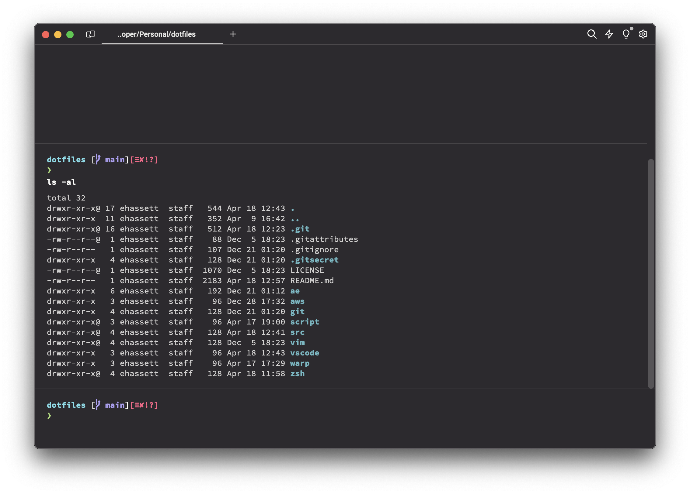
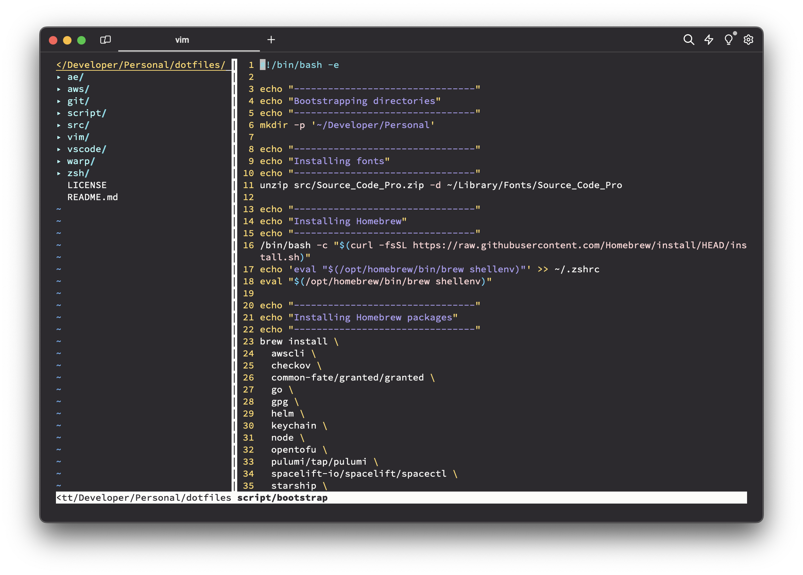
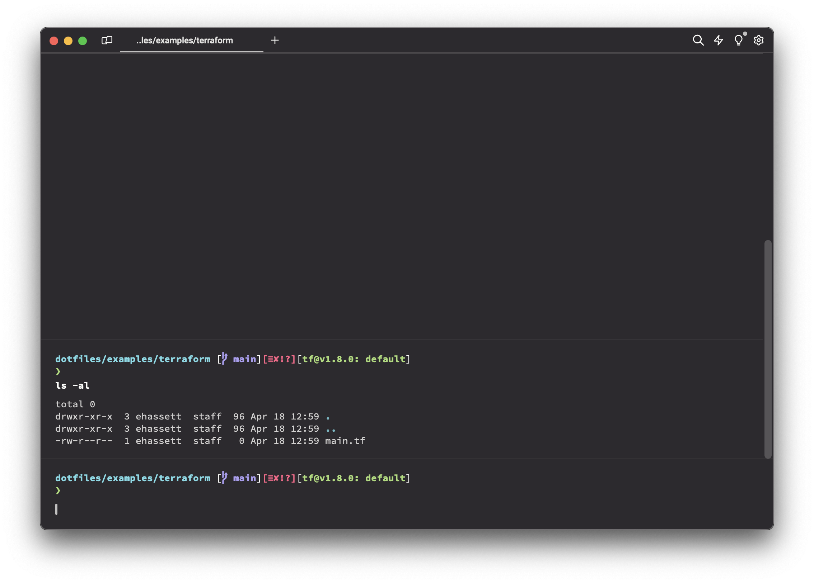
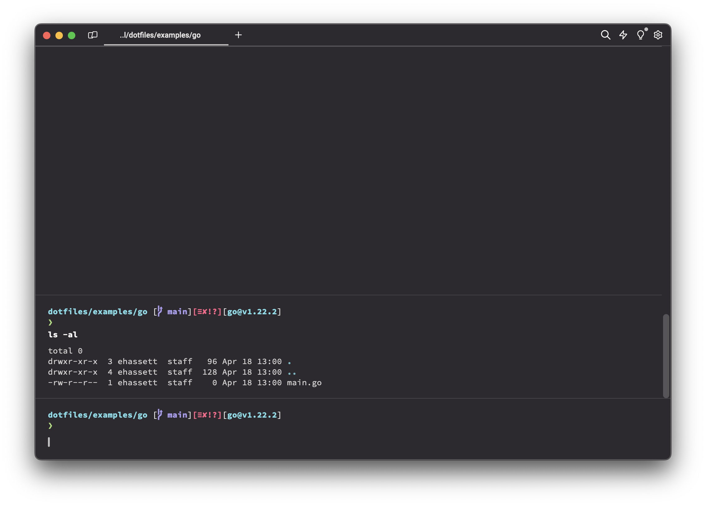

# dotfiles

This repo contains a collection of my dotfiles. Suggestions and contributions are welcome!

| basic                 | vim                 |
| --------------------- | ------------------- |
|  |  |

| terraform prompt                | go prompt         |
| ------------------------------- | ----------------- |
|  |  |

# Contents
- [dotfiles](#dotfiles)
- [Contents](#contents)
- [Prerequisites](#prerequisites)
- [Installation](#installation)
  - [Packages/Plugins](#packagesplugins)
  - [Fonts](#fonts)
  - [`ae`](#ae)
    - [pre-commit](#pre-commit)
- [Compatibilty](#compatibilty)

# Prerequisites

1. Xcode Command Line Tools: install with `xcode-select --install`
2. [VSCode](https://code.visualstudio.com/download) (optional)
    * `script/bootstrap` will copy settings if installed

# Installation

To install everything listed below, clone this repo and run `script/bootstrap`.

## Packages/Plugins

* [Homebrew](https://brew.sh)

* AWS
  * [aws cli](https://aws.amazon.com/cli/)
  * [granted](https://docs.commonfate.io/granted/introduction)

* [checkov](https://www.checkov.io)

* [go](https://golang.org/)

* [helm](https://helm.sh)

* [keychain](https://packages.ubuntu.com/bionic/keychain)

* [node](https://nodejs.org)

* [opentofu](https://opentofu.org)

* [pulumi](https://www.pulumi.com)

* [spacectl](https://docs.spacelift.io/concepts/spacectl)

* [terraform](https://terraform.io)
  * [terraform-docs](https://terraform-docs.io)
  * [tfswitch](https://tfswitch.warrensbox.com/)
  * [tflint](https://github.com/terraform-linters/tflint)

* [vim](https://packages.ubuntu.com/bionic/vim)
  * [colorizer](https://github.com/lilydjwg/colorizer)
  * [NERDTree](https://github.com/scrooloose/nerdtree)
  * [pathogen](https://github.com/tpope/vim-pathogen)
  * [vim-surround](https://github.com/tpope/vim-surround)
  * [monokai-pro](https://github.com/phanviet/vim-monokai-pro)

* [Warp](https://www.warp.dev)
  * Settings will need manually adjusted - choose `Source Code Pro` as font and `Monokai Pro` as theme

* [zsh](https://packages.ubuntu.com/bionic/zsh)
  * [oh-my-zsh](https://github.com/robbyrussell/oh-my-zsh)
  * [starship](https://starship.rs)

## Fonts

* [Source Code Pro](https://fonts.google.com/specimen/Source+Code+Pro)

## `ae`

> [!NOTE]
> Should be used by ehassett only and the directory is encrypted.

To install AE-specific components, navigate to [ae](ae/) and run the `script/bootstrap` located there.

### pre-commit
```
git-secret hide
git add .gitsecret
git add ae/**/*.secret
git add ae/**/.*.secret
```

# Compatibilty
* `script/bootstrap` has been tested on Mac.
